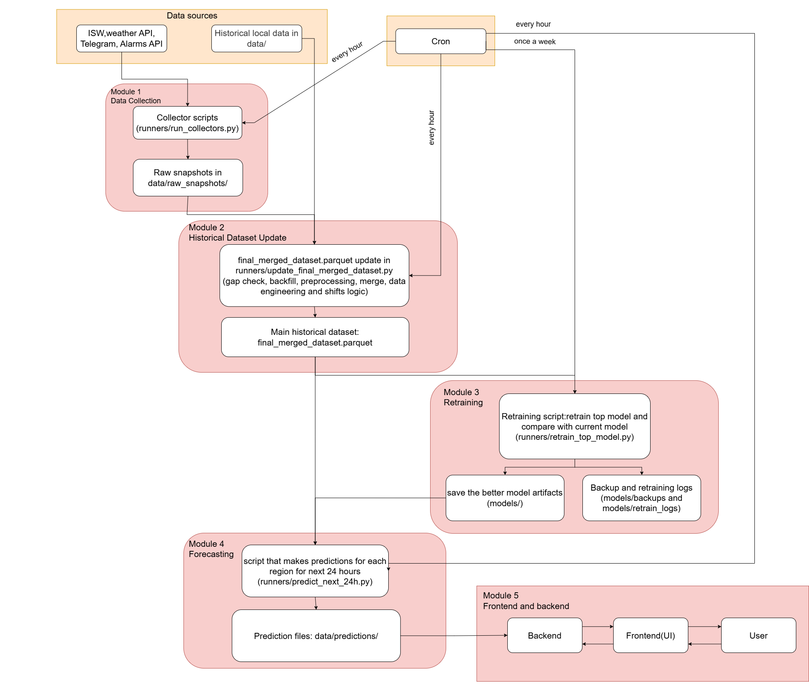
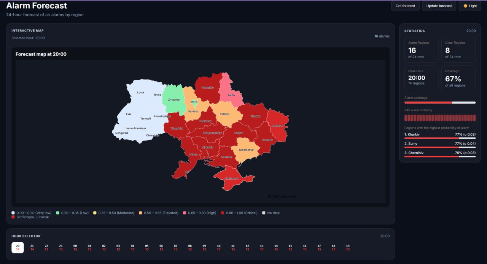

# Air Alarm Forecasting in Ukraine

This repository contains a machine learning pipeline for predicting whether an air alarm will be active in Ukrainian regions at hourly granularity. The project includes historical data preparation, model experiments, automated data collection, hourly dataset updates, next-24-hour prediction, model retraining, and a simple web interface.

This is a university project. It is not an official warning system.

## Table of Contents

- [Project Overview](#project-overview)
- [Data Flow](#data-flow)
- [Local Data and Artifacts](#local-data-and-artifacts)
- [Installation](#installation)
- [How to Start](#how-to-start)
- [Runtime Pipeline](#runtime-pipeline)
- [Prediction Output](#prediction-output)
- [Backend and Frontend](#backend-and-frontend)
- [System Diagram](#system-diagram)
- [User Interface](#user-interface)

## Project Overview

The project predicts the binary target `alarm_active` for each region and each hour:

- `1` - an air alarm is active during the hour;
- `0` - no air alarm is active during the hour.

The model works at hourly granularity.

The project has two main stages:

1. **Historical preparation**  
   Historical data is cleaned, processed, transformed, and merged into one dataset.

2. **Runtime automation**  
   New data snapshots are collected, the final dataset is updated, predictions for the next 24 hours are generated, and the model can be retrained periodically.

## Data Flow

The historical dataset is built from four main data sources:

1. **Weather data**  
   Hourly and daily weather features.

2. **Air alarm data**  
   Historical alarm events transformed into hourly binary labels.

3. **ISW reports**  
   Text reports processed with TF-IDF and dimensionality reduction.

4. **Telegram messages**  
   Channel messages processed into topic features and additional region-level signal features.

The general data flow is:

```text
raw historical data
        ↓
forecasting/eda_nlp_preparation.ipynb
        ↓
processed source files + NLP artifacts
        ↓
forecasting/data_merge_feature_engineering.ipynb
        ↓
data/final_merged_dataset.parquet
        ↓
model training
        ↓
models/2__hist_gradient_boosting__v1.pkl
```

After the historical dataset and model are prepared, the runtime pipeline can be used:

```text
runners/run_collectors.py
        ↓
runners/update_final_merged_dataset.py
        ↓
runners/predict_next_24h.py
        ↓
runners/retrain_top_model.py   # optional, periodic
```

---

## Local Data and Artifacts

The `data/` directory should be treated as **local project data** and is **not intended to be stored in GitHub**.

It contains files such as:

- `data/alarms-merged.csv`
- `data/all_weather_by_hour_2023-2026_v1.csv`
- `data/regions.csv`
- `data/telegram_data_v2`
- `data/isw_reports_v3`

If you clone the repository, you must prepare the local `data/` directory yourself, besides data from ISW and Telegram, you can collect it using scripts `data_receiver/collect_historical_isw_data_v2.py` and `data_receiver/telegram_scraper.py`

## Installation
Clone the repository:

```bash
git clone https://github.com/khorunzhaviktoriia/war-events-predictor-saas.git
cd war-events-predictor-saas
```

Create and activate a virtual environment:

```bash
python -m venv .venv
```

On Windows PowerShell:

```powershell
.venv\Scripts\Activate.ps1
```

On Linux/macOS:

```bash
source .venv/bin/activate
```

Install Python dependencies:

```bash
pip install -r requirements.txt
```

## How to Start

### 1. Prepare historical data

Run the notebooks in this order:

1. `forecasting/eda_nlp_preparation.ipynb`  
   EDA, preprocessing.
   
3. `data_receiver/fetch_donetsk_weather.py`

   The provided data `data/all_weather_by_hour_2023-2026_v1.csv` did not include Donetsk for the last year, so we collected this data from another source(Open-Meteo Historical Weather API)

5. `forecasting/donetsk_weather_patch.ipynb`

   This notebook patches the historical weather dataset with the collected Donetsk data.

7. `forecasting/data_merge_feature_engineering.ipynb`  
   This notebook merges all processed sources and creates the final dataset:
   ```text
   data/final_merged_dataset.parquet
   ```

8. Model notebooks
   
   You can only run the top model `forecasting/HistGradientBoostingClassifier.ipynb`.

### 2. Collect new data

```bash
python runners/run_collectors.py
```

This runner calls:

- `data_receiver/collect_absent_data.py`
- `data_receiver/telegram_scraper_cron.py`
- `data_receiver/get_weather_24h_OpenMeteo.py`

The scripts save raw snapshots under:

```text
data/raw_snapshots/
```

The weather forecast for inference is also collected during this step.


### 3. Update the historical dataset(`data/final_merged_dataset.parquet`)

```bash
python runners/update_final_merged_dataset.py
```

This script:

- reads raw snapshots
- preprocesses new rows
- appends them to processed source table
- rebuilds `data/final_merged_dataset.parquet`
- prepares weather forecast input for inference

### 4. Run hourly forecast

```bash
python runners/predict_next_24h.py
```

Predictions are saved to:

```text
data/predictions/
```

### 5. Retrain the model

```bash
python runners/retrain_top_model.py
```

The retraining script trains a new model, compares it with the current production model, and replaces the production model only if the new one is not worse.

## Runtime Pipeline

The expected runtime order is:

```text
run_collectors.py
        ↓
update_final_merged_dataset.py
        ↓
predict_next_24h.py
        ↓
retrain_top_model.py  # optional, not necessarily hourly
```

For hourly automation, the first three scripts can be scheduled with cron. Retraining can be scheduled less frequently because it is heavier than inference.

Example cron idea:

```cron
0 * * * * cd /path/to/war-events-predictor-saas && .venv/bin/python runners/run_collectors.py
10 * * * * cd /path/to/war-events-predictor-saas && .venv/bin/python runners/update_final_merged_dataset.py
20 * * * * cd /path/to/war-events-predictor-saas && .venv/bin/python runners/predict_next_24h.py
```
Retraining can be scheduled less often, for example once per day or once per week:

```cron
30 3 * * * cd /path/to/war-events-predictor-saas && /path/to/.venv/bin/python runners/retrain_top_model.py >> logs/retrain.log 2>&1
```

## Prediction Output

The forecasting script saves predictions as a JSON file. The output contains metadata and per-region forecasts.

Example structure:

```json
{
  "last_model_train_time": "2026-04-15T03:03:03+03:00",
  "last_prediction_time": "2026-04-15T06:00:17+03:00",
  "threshold": 0.6,
  "hours": 24,
  "regions": 24,
  "rows": 576,
  "regions_forecast": {
    "Вінницька": {
      "region_id": 1,
      "city_name": "Vinnytsia",
      "forecast": {
        "2026-04-14 20:00": true,
        "2026-04-14 21:00": true
      },
      "forecast_proba": {
        "2026-04-14 20:00": 0.9314,
        "2026-04-14 21:00": 0.9339
      }
    }
  }
}
```

## Backend and Frontend

### Backend

```bash
cd app/backend
uvicorn app.main:app --host 0.0.0.0 --port 8000 --reload
```

### Frontend

```bash
cd app/frontend
npm install
npm run dev -- --host 0.0.0.0 --port 5173
```

Instead of **<0.0.0.0>**, write the address of the device on which you are running the commands.

## System Diagram



## User Interface


